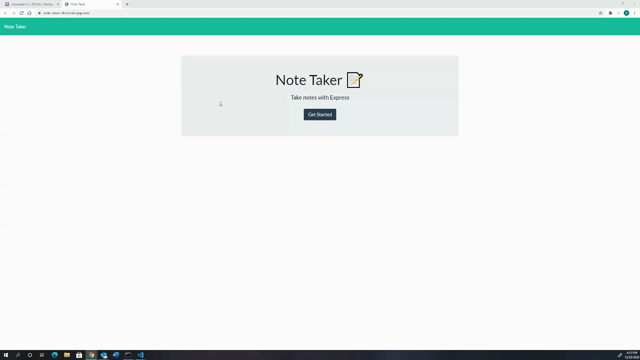

# Project Title : NoteTaker
## Project Description:
This application application allows a user to create notes and save. This application was created to aid as a 'notepad'.  
## Table of Contents
* [Installation](#installation)
* [Usage](#usage)
* [Contributing](#contributing)
* [Test](#test)
* [Questions](#questions)
* [Author] (#Author)
## Installation
Clone the project and or visit the link
## Usage

## Contributors
Jcsanchez
## If you wish to contribute
Not at this time
## Questions
If you have any questions, contact J-Sanchez on GitHub.
## Test
N/A
### Contact Me
jonathan.sanchez@windstream.net
### Link to Github
https://github.com/J-sanchez